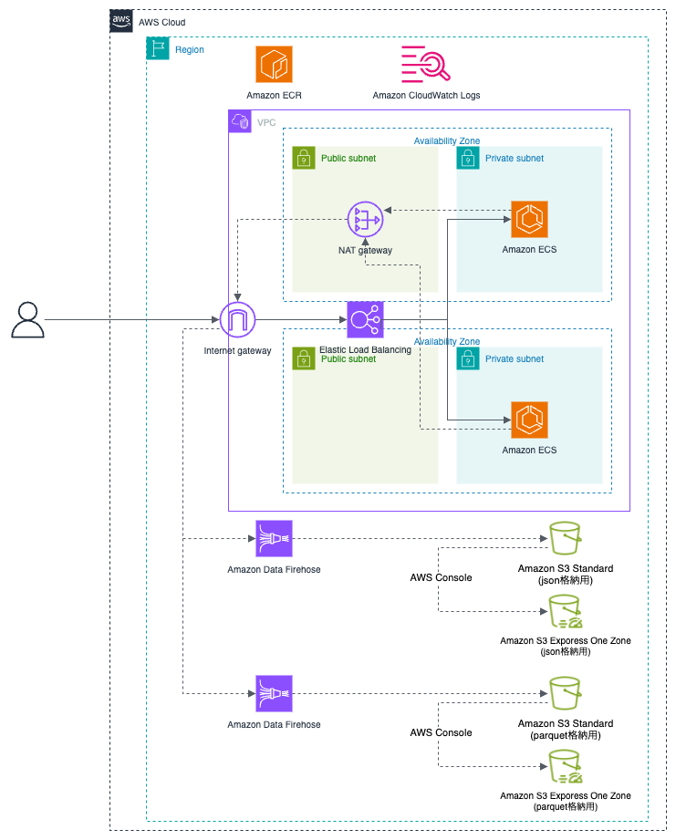

# builders.flash-202506-material

builders.flash-202506-material

## 構成図



## 環境構築手順

### tfstate 用の S3 を作成

```bash
YOUR_NAME="shigeruoda"

CURRENT_TIME=$(date +"%Y%m%d%H%M%S")
BUCKET_NAME="tfstate-${YOUR_NAME}-${CURRENT_TIME}"
echo "$BUCKET_NAME"

aws s3api create-bucket \
  --bucket "$BUCKET_NAME" \
  --region ap-northeast-1 \
  --create-bucket-configuration LocationConstraint=ap-northeast-1
```

### main.tf を変更

`./terraform/main.tf`の 3 行目を変更

```
terraform {
  backend "s3" {
    bucket  = "tfstate-shigeruoda-20250506093223" <- ここを更新
    key     = "terraform.tfstate"
    region  = "ap-northeast-1"
    encrypt = true
  }
}
```

### Data Lake 管理者を設定

- AWS コンソールで AWS Lake Formation に移動
- 左ペインの Data lake settings を開く
- Administrators セクションで Add administrators をクリック
- Terraform を実行した IAM ユーザーまたはロール（例: あなたの IAM ユーザー名）を追加して Save

### terraform 適用

```
cd ./terraform/
terraform init
terraform plan
terraform apply
```

### docker image の push

AWS ログイン情報は事前に設定されていること

```
cd ./docker/
./ecr-push.sh
```

### API へのアクセス

```
# DNS名取得
DNS_NAME=$(aws elbv2 describe-load-balancers \
  --names buildersflash-alb \
  --query 'LoadBalancers[0].DNSName' \
  --output text
)

# health
curl -X GET http://$DNS_NAME/health

# orders
curl -X POST http://$DNS_NAME/api/v1/orders \
  -H "Content-Type: application/json" \
  -H "X-User-ID: user-123" \
  -d '{"item_id": "item-abc"}'

# batch
curl -X POST http://$DNS_NAME/api/v1/batch \
  -H "Content-Type: application/json" \
  -d '{"count": 3}'
```

### Amazon S3 Express One Zone への反映

Amazon Data Firehose からは Amazon S3 Standard のみに反映されます。
Amazon S3 Express One Zone に反映する場合は

- AWS コンソールで`Amazon S3`へ移動
- 左ペインから`ディレクトリバケット`を選択、以下 2 つのバケットがあります。
  - buildersflash-api-logs-json-xxxxxxxx--apne1-az1--x-s3
  - buildersflash-api-logs-parquet-xxxxxxxx--apne1-az1--x-s3
- 左ペインから`ディレクトリバケット`を選択、以下 2 つのバケットがあります。
- 一つのバケットのチェックボックスを入れて、インポートボタンを押下
  - インポート元の汎用バケットは以下です
    - buildersflash-api-logs-json-xxxxxxxx
    - buildersflash-api-logs-parquet-xxxxxxxx
