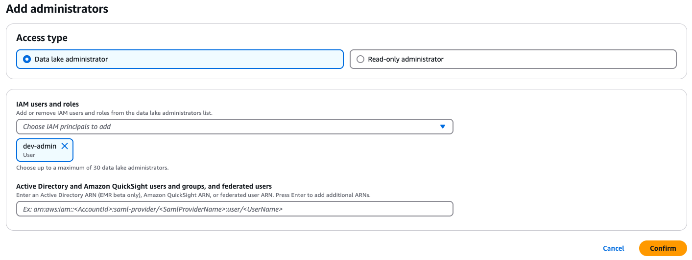

# builders.flash-202506-material

builders.flash-202506-material

## 構成図


## 環境構築手順

### Install AWS CLI（未 Install の場合）

リンク先の手順書を参考に AWS CLI を Install をして下さい
https://docs.aws.amazon.com/ja_jp/cli/latest/userguide/getting-started-install.html

私の Version は以下で利用しています

```
% aws --version
aws-cli/2.27.12 Python/3.13.3 Darwin/24.4.0 exe/x86_64
```

### Install Terraform（未 Install の場合）

リンク先の手順書を参考に Terraform を Install をして下さい
https://developer.hashicorp.com/terraform/tutorials/aws-get-started/install-cli

私の Version は以下で利用しています

```
% terraform --version
Terraform v1.11.4
on darwin_arm64
```

### Install git（未 Install の場合）

```
リンク先の手順書を参考に git を Install をして下さい
https://git-scm.com/downloads

私の Version は以下で利用しています

```

% git --version
git version 2.49.0

```

### git clone
```

git clone https://github.com/shigeru-oda/builders.flash-202506-material.git
cd builders.flash-202506-material

````

### tfstate 用の S3 を作成

```bash
YOUR_NAME="shigeruoda" <- ここを更新

CURRENT_TIME=$(date +"%Y%m%d%H%M%S")
BUCKET_NAME="tfstate-${YOUR_NAME}-${CURRENT_TIME}"
echo "$BUCKET_NAME"

aws s3api create-bucket \
  --bucket "$BUCKET_NAME" \
  --region ap-northeast-1 \
  --create-bucket-configuration LocationConstraint=ap-northeast-1
````

### main.tf を変更

`./terraform/main.tf`の 3 行目を変更

```./terraform/main.tf
terraform {
  backend "s3" {
    bucket  = "tfstate-shigeruoda-20250506093223" <- ここを更新
    key     = "terraform.tfstate"
    region  = "ap-northeast-1"
    encrypt = true
  }
}
```

### Data Lake 管理者を設定

- [AWS コンソールで AWS Lake Formation に移動](https://ap-northeast-1.console.aws.amazon.com/lakeformation/home?region=ap-northeast-1#firstRun)
- 左ペインの `Administrative roles and tasks` を開く
- `Data lake administrators` セクションで `Add` をクリック
- Access type で`Data lake administrator`を選択し、IAM users and roles は自身の USER/Role を選択し、`Confirm`をクリック
  

### terraform 適用

```
cd ./terraform/
terraform init
terraform apply
-> yes

※作成の前後関係設定がイマイチで、terraformが途中で落ちる場合があります。
  再度terraform applyすることで正常終了ことを確認しています
```

### docker image の push

AWS ログイン情報は事前に設定されていること

```
cd ./docker/
./ecr-push.sh
```

### API へのアクセス

```
# DNS名取得
DNS_NAME=$(aws elbv2 describe-load-balancers \
  --names buildersflash-alb \
  --query 'LoadBalancers[0].DNSName' \
  --output text
)

# health
curl -X GET http://$DNS_NAME/health

# orders
curl -X POST http://$DNS_NAME/api/v1/orders \
  -H "Content-Type: application/json" \
  -H "X-User-ID: user-123" \
  -d '{"item_id": "item-abc"}'

# batch
curl -X POST http://$DNS_NAME/api/v1/batch \
  -H "Content-Type: application/json" \
  -d '{"count": 3}'
```

### Amazon S3 Express One Zone への反映

Amazon Data Firehose からは Amazon S3 Standard のみに反映されます。
Amazon S3 Express One Zone に反映する場合は

- AWS コンソールで`Amazon S3`へ移動
- 左ペインから`ディレクトリバケット`を選択、以下 2 つのバケットがあります。
  - buildersflash-api-logs-json-xxxxxxxx--apne1-az1--x-s3
  - buildersflash-api-logs-parquet-xxxxxxxx--apne1-az1--x-s3
- 左ペインから`ディレクトリバケット`を選択、以下 2 つのバケットがあります。
- 一つのバケットのチェックボックスを入れて、インポートボタンを押下
  - インポート元の汎用バケットは以下です
    - buildersflash-api-logs-json-xxxxxxxx
    - buildersflash-api-logs-parquet-xxxxxxxx
